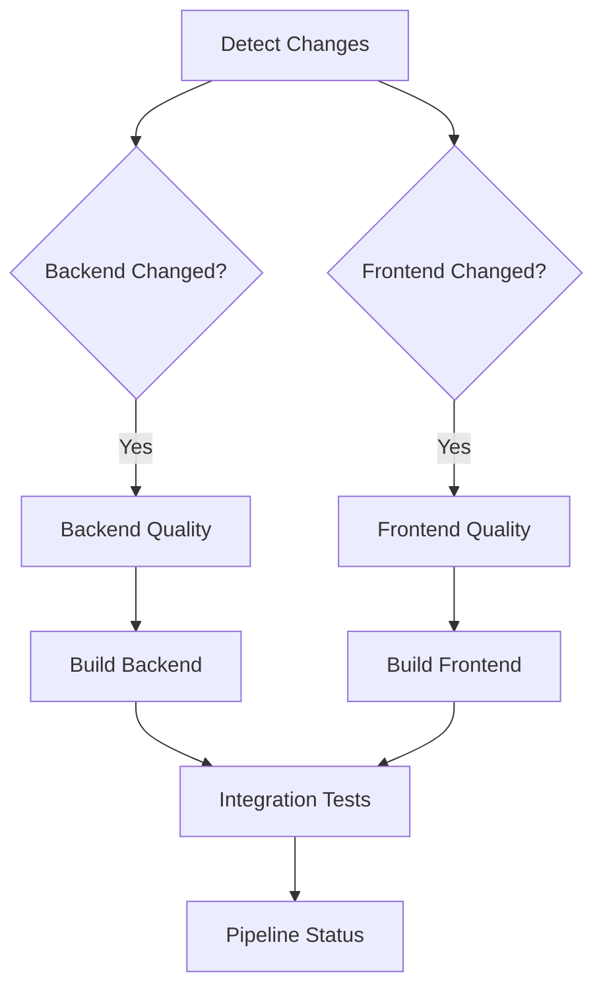

# GitHub Actions Workflows

Modern CI/CD pipeline architecture with reusable components and intelligent change detection.

## 📋 Architecture Overview

```
┌─────────────────────────────────────────────────────────┐
│              Main Workflows (Entry Points)              │
├─────────────────────────────────────────────────────────┤
│  ci-pipeline.yml         → Main orchestration pipeline  │
│  backend-quality.yml     → Backend quality checks       │
│  frontend-quality.yml    → Frontend quality checks      │
│  auto-i18n.yml           → Automated translation        │
│  autofix.yml             → Auto-fix formatting          │
└─────────────────────────────────────────────────────────┘
                        ↓ uses
┌─────────────────────────────────────────────────────────┐
│         Reusable Workflows (Job-level Reuse)            │
├─────────────────────────────────────────────────────────┤
│  _reusable-quality-backend.yml                          │
│  _reusable-quality-frontend.yml                         │
└─────────────────────────────────────────────────────────┘
                        ↓ uses
┌─────────────────────────────────────────────────────────┐
│        Composite Actions (Step-level Reuse)             │
├─────────────────────────────────────────────────────────┤
│  .github/actions/                                        │
│    ├─ setup-pnpm/        → pnpm + Node.js setup        │
│    └─ setup-uv/          → uv + Python setup           │
└─────────────────────────────────────────────────────────┘
```

## 🎯 CI Pipeline Flow

### Main Pipeline (`ci-pipeline.yml`)

**Trigger**: Push to `main` or Pull Request



**Features:**

| Feature | Description |
|---------|-------------|
| ✅ Intelligent change detection | Only runs affected jobs |
| ✅ Parallel execution | Quality checks run simultaneously |
| ✅ Conditional builds | Only if quality passes |
| ✅ Comprehensive status reporting | Aggregated job results |
| ✅ Concurrency control | Cancels outdated runs |

### Pipeline Stages

| Stage | Description | Trigger Condition |
|-------|-------------|-------------------|
| **Stage 0: Change Detection** | Uses `dorny/paths-filter@v3` for smart file detection | Always |
| **Stage 1: Quality Gate** | Backend: Ruff + 109 tests<br>Frontend: ESLint + Prettier + TypeScript | If code changed |
| **Stage 2: Build** | Backend: Package build<br>Frontend: Next.js production build | If quality passes |
| **Stage 3: Integration Tests** | E2E tests (Playwright/Cypress) | If builds succeed |
| **Final: Status Report** | Aggregates results, fails if any required job fails | Always |

## 📦 Reusable Components

### Composite Actions

#### `setup-pnpm`

Setup pnpm with Node.js and dependency caching.

**Inputs:**

| Parameter | Required | Default | Description |
|-----------|----------|---------|-------------|
| `working-directory` | No | `web` | Working directory containing package.json |
| `node-version` | No | _auto-detect_ | Node.js version (auto-detected from package.json if not specified) |

**Usage:**

```yaml
- uses: ./.github/actions/setup-pnpm
  with:
    working-directory: web
```

#### `setup-uv`

Setup uv with Python and dependency caching.

**Inputs:**

| Parameter | Required | Default | Description |
|-----------|----------|---------|-------------|
| `working-directory` | No | `api` | Working directory containing pyproject.toml |
| `python-version` | No | _auto-install_ | Python version (auto-installed if not specified) |
| `enable-cache` | No | `true` | Enable dependency caching |

**Usage:**

```yaml
- uses: ./.github/actions/setup-uv
  with:
    working-directory: api
```

### Reusable Workflows

#### `_reusable-quality-backend.yml`

Complete backend quality checks with PostgreSQL service.

**Inputs:**

| Parameter | Type | Required | Default | Description |
|-----------|------|----------|---------|-------------|
| `working-directory` | string | No | `api` | Backend working directory |
| `python-version` | string | No | _empty_ | Python version (auto-detect if empty) |
| `postgres-version` | string | No | `18` | PostgreSQL version |
| `run-tests` | boolean | No | `true` | Run test suite |

**Jobs:**

1. Setup uv and Python
2. Ruff linting
3. Ruff formatting check
4. Pytest execution with coverage

**Artifacts:**

| Artifact | Condition | Retention |
|----------|-----------|-----------|
| `backend-coverage` | If tests run | 7 days |

**Usage:**

```yaml
jobs:
  backend:
    uses: ./.github/workflows/_reusable-quality-backend.yml
    secrets: inherit
```

#### `_reusable-quality-frontend.yml`

Complete frontend quality checks with optional build.

**Inputs:**

| Parameter | Type | Required | Default | Description |
|-----------|------|----------|---------|-------------|
| `working-directory` | string | No | `web` | Frontend working directory |
| `node-version` | string | No | _empty_ | Node.js version (auto-detect if empty) |
| `run-build` | boolean | No | `false` | Run build step |

**Jobs:**

1. Setup pnpm and Node.js
2. Run quality checks (ESLint + Prettier + TypeScript)
3. Optional: Production build

**Artifacts:**

| Artifact | Condition | Retention |
|----------|-----------|-----------|
| `frontend-build` | If build runs and succeeds | 7 days |

**Usage:**

```yaml
jobs:
  frontend:
    uses: ./.github/workflows/_reusable-quality-frontend.yml
    with:
      run-build: true
    secrets: inherit
```

## 🔧 Workflows

### `ci-pipeline.yml` - Main Quality Pipeline

**Purpose**: Intelligent orchestration pipeline with change detection and parallel execution.

**Trigger**: All pushes and pull requests to `main` branch

**Features**:
- Smart change detection (only runs affected jobs)
- Parallel quality checks (backend + frontend simultaneously)
- Conditional builds (only if quality passes)
- Aggregated status reporting

**GitHub Status Checks**:
- `CI Pipeline / Backend Quality` - Backend linting, formatting, tests
- `CI Pipeline / Frontend Quality` - Frontend linting, formatting, TypeScript
- `CI Pipeline / Pipeline Status` - Overall pipeline result

### `auto-i18n.yml` - Automated Translation

**Purpose**: Auto-translate i18n messages when English source changes.

**Trigger**: Push to `main` with `web/messages/en-US/**` changes

**Features**:
- Cleans extra translation keys
- Translates missing keys via MyMemory API
- Updates TypeScript type definitions
- Creates PR with automated translations

**Implementation**: Uses `setup-pnpm` composite action

### `autofix.yml` - Code Formatting

**Purpose**: Automatically fix code formatting issues.

**Trigger**: Push/PR to `main`

**Features**:
- Auto-fixes Ruff violations (backend)
- Auto-fixes ESLint violations (frontend)
- Commits fixes automatically

## 🚀 Best Practices Applied

### ✅ Efficiency

| Practice | Implementation |
|----------|----------------|
| **Change Detection** | Only runs affected jobs using `paths-filter` |
| **Parallel Execution** | Independent jobs run simultaneously |
| **Caching** | Dependencies cached via official actions |
| **Concurrency Control** | Cancels outdated pipeline runs |

### ✅ Maintainability

| Practice | Implementation |
|----------|----------------|
| **DRY Principle** | Composite actions eliminate duplication |
| **Single Responsibility** | Each workflow has clear purpose |
| **Naming Convention** | `_reusable-*` prefix for reusable workflows |
| **Documentation** | Inline comments and comprehensive README |

### ✅ Scalability

| Practice | Implementation |
|----------|----------------|
| **Extensible Architecture** | Easy to add new stages/jobs |
| **Matrix Strategy Ready** | Reusable workflows support matrix builds |
| **Environment Support** | Can extend for staging/production deploys |
| **Artifact Management** | Build artifacts uploaded for deployment |

### ✅ Security

| Practice | Implementation |
|----------|----------------|
| **Secrets Management** | Uses `secrets: inherit` pattern |
| **Minimal Permissions** | Actions use only required permissions |
| **Pinned Versions** | Actions pinned to major versions (`@v4`) |
| **Conditional Execution** | Sensitive jobs run only when needed |

## 📊 Metrics

### Code Reduction

| Metric | Value |
|--------|-------|
| **Before** | 93 lines across 4 workflows |
| **After** | 31 lines in main workflows + reusable components |
| **Reduction** | 67% less duplication |

### Performance

| Metric | Value |
|--------|-------|
| **Parallel Jobs** | Quality checks run simultaneously |
| **Smart Triggers** | Only affected code is checked |
| **Cached Dependencies** | 2-3x faster subsequent runs |

## 🔮 Future Enhancements

### Short-term

- [ ] Add E2E testing with Playwright
- [ ] Implement Docker build caching
- [ ] Add code coverage reporting

### Medium-term

- [ ] Multi-environment deployment (staging/production)
- [ ] Performance testing integration
- [ ] Security scanning (Trivy/CodeQL)

### Long-term

- [ ] Matrix testing (Python 3.12/3.13, Node 20/22)
- [ ] Automated rollback mechanism
- [ ] Deployment health checks
- [ ] Slack/Discord notifications

## 📚 References

- [GitHub Actions Best Practices](https://docs.github.com/en/actions/learn-github-actions/best-practices-for-github-actions)
- [Reusable Workflows](https://docs.github.com/en/actions/using-workflows/reusing-workflows)
- [Composite Actions](https://docs.github.com/en/actions/creating-actions/creating-a-composite-action)
- [Path Filtering](https://github.com/dorny/paths-filter)
